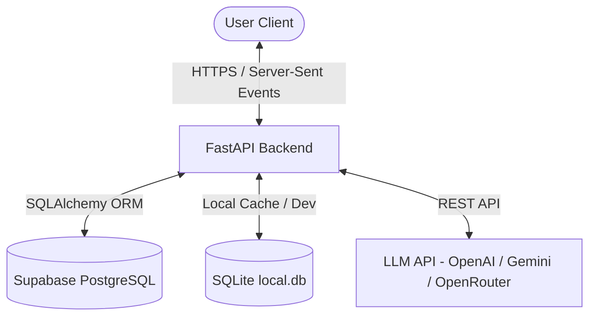

# Esona Architecture Overview

Esona is an agentic mental wellness companion built as a full-stack application. It leverages a modern, monorepo-based architecture combining a Python (FastAPI) backend with a Next.js (TypeScript) frontend.

## Overall System Flow



1. **User Client (Next.js)**: Displays a responsive, cinematic dark-themed UI. Communicates with the backend using REST APIs for user authentication, onboarding, and dashboard retrieval, and standard Server-Sent Events (SSE) for real-time chat streaming.
2. **FastAPI Backend**: Orchestrates the multi-agent cognitive workflow, computes real-time emotion classifications, records structured memories, extracts knowledge graph items, and routes prompts to LLM providers.
3. **Database (Supabase / SQLite)**: Persistent storage is handled in production via Supabase PostgreSQL, with full compatibility for local SQLite development.
4. **LLM Integration**: Dynamically routes and falls back between OpenAI, Gemini, and OpenRouter API providers depending on availability and role requirements.

---

## Folder Structure

```
esona/
├── docs/                     # Architectural sub-documents
├── backend/                  # FastAPI python application
│   ├── app/
│   │   ├── main.py           # Application entry point
│   │   ├── config.py         # Settings & environment variables
│   │   ├── database.py       # Session makers & SQLite/Postgres setups
│   │   ├── agents/           # Logical cognitive steps
│   │   ├── chatbot/          # LangGraph graph pipeline
│   │   ├── models/           # SQLAlchemy DB models
│   │   ├── routes/           # REST endpoints & SSE routes
│   │   ├── schemas/          # Pydantic schemas
│   │   └── services/         # Services (MentalBERT, Memory, KG)
│   └── initialize_db.py      # Local SQLite database bootstrap
├── frontend/                 # Next.js Next 15 App Router web client
│   ├── src/
│   │   ├── app/              # Views (chat, login, onboarding, growth)
│   │   ├── components/       # Reusable React components (glassmorphism)
│   │   ├── hooks/            # Custom React hooks (useChat, useOnboarding)
│   │   ├── api/              # API clients & sync wrappers
│   │   ├── database/         # Supabase client instantiation
│   │   ├── providers/        # Auth & Theme context wrappers
│   │   └── utils/            # CSS merging & date utilities
│   └── public/               # Atmosphere video backgrounds & assets
└── supabase/                 # Database schema exports
```
